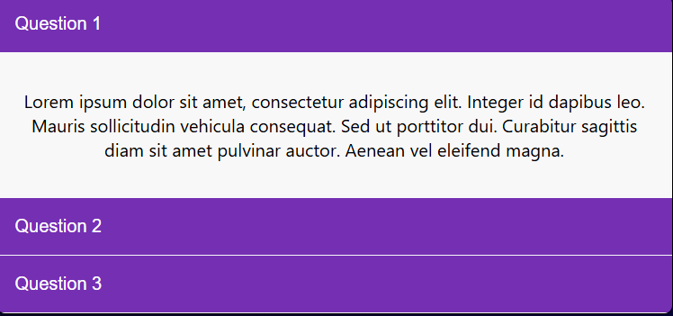
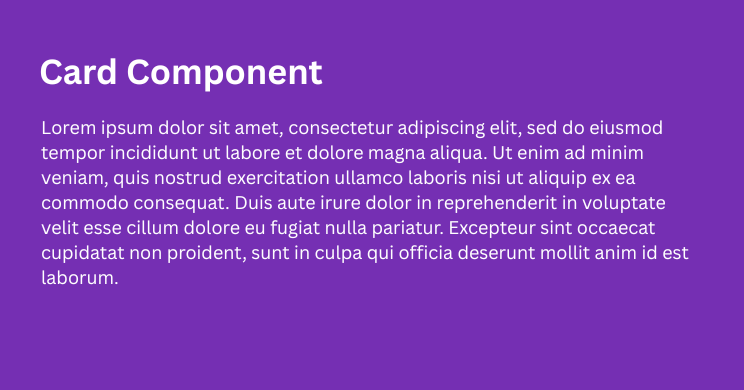
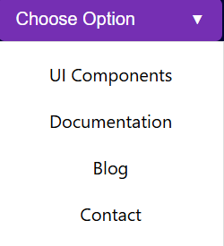
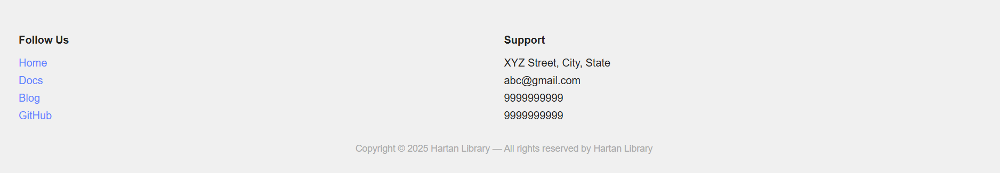
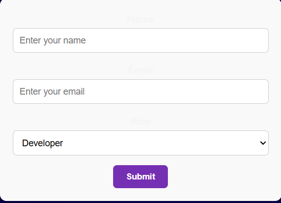
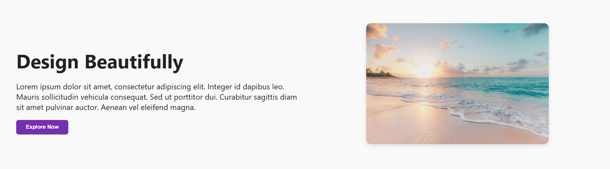
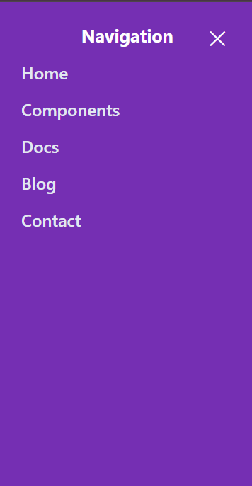
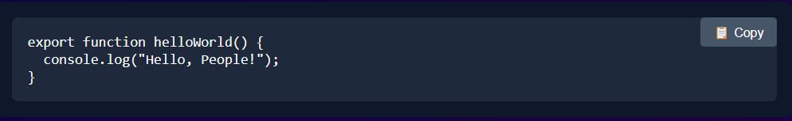
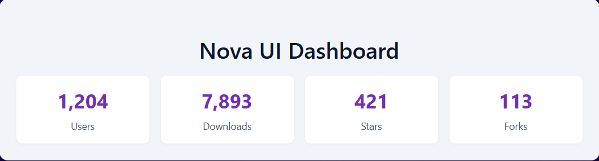

# Pixelnova UI

## 👋 Introduction
**Pixelnova UI** is a lightweight, customizable, and fully responsive UI component library built entirely with HTML, CSS, and vanilla JavaScript. Designed with both developers and designers in mind, Pixelnova UI provides a sleek and modern set of pre-built components that can be effortlessly integrated into any web project—without relying on bulky frameworks or complex setups.

Whether you're rapidly prototyping a landing page or crafting a polished production-ready application, Pixelnova UI offers you the flexibility to tailor components to your brand's identity. With a focus on clean design, accessibility, and ease of use, Pixelnova empowers you to build consistent, visually appealing user interfaces while keeping your codebase minimal and maintainable.

---

## 🚀 Installation

Install with npm
```bash
npm install pixelnova-ui
```

---

## ✨ Features

- 🎨 **Beautifully Designed** – Clean, modern components built with responsiveness in mind.
- ⚙️ **Customizable** – Easily override styles to fit your brand.
- 🧱 **Modular** – Import only the components you need.
- 💡 **Lightweight** – Built with performance and simplicity at the core.
- 🧰 **Developer-Friendly** – Clear class naming and consistent design patterns.

---


## 📦 Components

### 1. Accordion

```bash
import { createAccordion } from 'pixelnova-ui';
```



### 2. Button

```bash
import { createButton } from 'pixelnova-ui';
```


### 3. Card

```bash
import { createCard } from 'pixelnova-ui';
```

 

### 4. Carousel

```bash
import { createCarousel } from 'pixelnova-ui';
```


### 5. Dropdown

```bash
import { createDropdown } from 'pixelnova-ui';
```



### 6. Footer

```bash
import { createFooter } from 'pixelnova-ui';
```



### 7. Form

```bash
import { createForm } from 'pixelnova-ui';
```



### 8. Hero

```bash
import { createHero } from 'pixelnova-ui';
```


### 9. Hero Split

```bash
import { createHeroSplit } from 'pixelnova-ui';
```



### 10. Modal

```bash
import { createModal } from 'pixelnova-ui';
```


### 11. Navbar

```bash
import { createNavbar } from 'pixelnova-ui';
```


### 12. Pop Up

```bash
import { createPopup } from 'pixelnova-ui';
```


### 13. Sidemenu

```bash
import { createSidemenu } from 'pixelnova-ui';
```



### 14. Snippet

```bash
import { createSnippet } from 'pixelnova-ui';
```



### 15. Statistics

```bash
import { createStatistics } from 'pixelnova-ui';
```



---

## 📄 License

MIT License © 2024 Rupali Singh Dev
